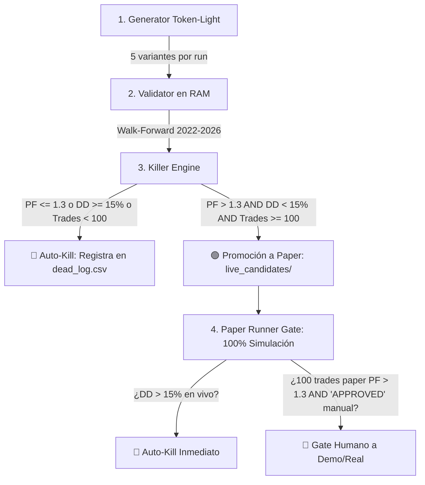

# 🏭 Automaton Strategy Factory: Manual Operativo & Protocolo de Seguridad

> **REGLA DE ORO DE SEGURIDAD (CRÍTICA)**:
> **"Ninguna estrategia toca dinero real sin APPROVED humano + 100 trades paper con PF>1.3"**

---

## 🏛️ Arquitectura de la Fábrica

La fábrica cuantitativa opera en 4 fases ultra-optimizadas en tokens y tiempo de cómputo:



### 1. Generator (`src/factory/generator.py`)
- Genera exactamente **5 variantes deterministas por ciclo** (Rolling windows 60/90/120, $Z_{\text{entry}}$ 2.2/2.5/2.8, Time-Stop 24/36h).
- No inventa indicadores arbitrarios; usa combinatoria sobre modelos probados de reversión a la media.

### 2. Validator (`src/factory/validator.py`)
- Carga en memoria RAM los CSVs multi-año ya descargados en `data/historical/`.
- Ejecuta Walk-Forward multi-periodo: **Train (2022-2023), Test (2024), Validation Out-of-Sample (2024-2026)** con deducción exacta de comisiones ($0.16\%$).
- **Métrica única de supervivencia**:
  $$\text{Validation PF} > 1.30 \quad \text{AND} \quad \text{Max DD} < 15.0\% \quad \text{AND} \quad \text{Trades} \ge 100$$

### 3. Killer & Registry (`src/factory/killer.py`)
- **Si aprueba**: Guarda la configuración en `src/strategies/live_candidates/` y la registra en `src/factory/registry.json` con estado `"PAPER_ACTIVE"` y `"human_approval": "PENDING"`.
- **Si reprueba**: Borra el código de inmediato y guarda la autopsia en `src/factory/dead_log.csv` (cero código muerto guardado, máxima eficiencia de tokens).

### 4. Paper Runner Gate & Seguridad
- Todas las candidatas corren **exclusivamente en modo Paper Trading** en [`src/execution/pairs_trading_paper_runner.py`](file:///Users/jorgeatilano/Desktop/DEVIN/trading-autonomous-system/src/execution/pairs_trading_paper_runner.py).
- **Prohibido tocar balances reales automáticamente**: Para pasar una estrategia a ejecución en cuenta Binance, el usuario debe editar manualmente `src/factory/registry.json` y cambiar `"human_approval": "PENDING"` por `"human_approval": "APPROVED"`.
- **Circuito de Seguridad**: Si cualquier estrategia en paper sufre un Drawdown $> 15\%$, es eliminada automáticamente.

---

## ⚡ Cómo Ejecutar 1 Ciclo de Fábrica

Desde la terminal en tu Mac:

```bash
python factory/loop.py
```
o
```bash
python src/factory/loop.py
```
