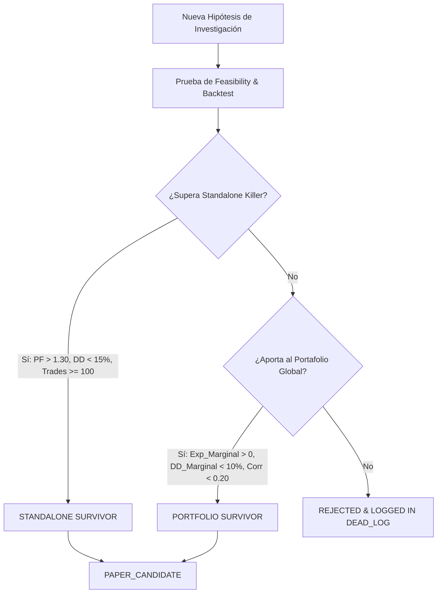

# Automaton Economic Architecture: Autonomous Revenue Engine

**Fecha de Publicación**: 2026-08-20  
**Versión**: 2.0 (Economic Redesign)  
**Estado**: PROPOSED / ARCHITECTURAL BLUEPRINT  

---

## 1. Executive Summary & Paradigm Shift

### El Cambio de Paradigma
Automaton ha evolucionado desde una herramienta de backtesting hacia un sistema autónomo de investigación. Sin embargo, su diseño original padecía de **"Snippet & Standalone Tunnel Vision"**: trataba a cada hipótesis como una isla aislada que debía generar ingresos por sí sola y superar un filtro inflexible de Profit Factor ($PF > 1.30$) sin considerar su contribución a la diversificación de un portafolio o su valor como producto de información.

**Nuevo Principio Fundacional**:
> Automaton no es una fábrica de estrategias aisladas; es un **Autonomous Revenue Engine** diseñado para transformar ventajas estadísticas y capacidades computacionales en flujo de caja recurrente.

---

## 2. Los 5 Pilares de la Arquitectura Económica

```
+-----------------------------------------------------------------------------------+
|                            AUTONOMOUS REVENUE ENGINE                              |
+-----------------------------------------------------------------------------------+
                                          |
     +-------------------+----------------+-------------------+------------------+
     |                   |                |                   |                  |
+----+----+        +-----+----+     +-----+-----+       +-----+-----+      +-----+-----+
|  ALPHA  |        | STRATEGY |     | PORTFOLIO |       |  CAPITAL  |      |  REVENUE  |
| FACTOR  |------> | BUILDER  |---> | ALLOCATOR |-----> | REALITY   |----> |  ENGINES  |
| LIBRARY |        |          |     |           |       |  ENGINE   |      | (A, B, C) |
+---------+        +----------+     +-----------+       +-----------+      +-----------+
```

### A) Alpha Factor Library
- **Definición**: Un **Alpha Factor** es una señal o anomalía cuantitativa (e.g. cointegración de pares, momentum macro, insider cluster, imbalance de libro) que contiene poder predictivo sobre retornos futuros o volatilidad.
- **Principio**: Un factor no necesita ser rentable de forma *standalone* (con comisionestaker completas y sin gestión de riesgo). Su valor puede radicar en mejorar el Sharpe ratio del portafolio global o reducir el drawdown sistemático.

### B) Strategy Construction
- **Definición**: Combinación de uno o más Alpha Factors con reglas de ejecución, gestión de colateral y órdenes para transformar la señal en una posición transable.

### C) Portfolio Allocator
- **Definición**: Motor de integración multiactivo (Crypto + US Equities + Commodities) que combina estrategias descorrelacionadas utilizando Paridad de Volatilidad Inversa, Ponderación por Riesgo Marginal (Risk Budgeting) y caps de concentración.

### D) Capital Reality Engine
- **Definición**: Simulador financiero de horizonte continuo que proyecta los requerimientos de capital real necesarios para alcanzar metas de ingresos mensuales en dinero fiduciario ($MXN / $USD), incorporando fricciones, Monte Carlo Drawdown y Value at Risk (VaR 95%).

### E) Revenue Engines (Tres Vías de Monetización)
- **ENGINE A (Trading Alpha)**: Ingresos por retornos netos de capital propio/paper abonados al portafolio.
- **ENGINE B (Information & Event Alpha)**: Monetización de feeds de datos de anomalías estructuradas (e.g. alertas tempranas de cointegración, alertas de clusters SEC).
- **ENGINE C (AI Quant Services / Micro-SaaS)**: Servicios autónomos de auditoría cuantitativa, verificación de backtests y validación de riesgo para terceros.

---

## 3. Dual Killer Framework: Standalone vs Portfolio Survivor

Para no perder el rigor de seguridad existente pero permitir la incorporación de activos diversificadores, Automaton implementa un marco dual de evaluación:



### Framework 1: `STANDALONE_SURVIVOR` (Mantener intacto)
Criterio estricto e innegociable para estrategias independientes de alto rendimiento:
$$\text{Profit Factor} > 1.30 \quad | \quad \text{Max Drawdown} < 15\% \quad | \quad \text{Trades OOS} \ge 100 \quad | \quad \text{Expectancy} > 0$$

### Framework 2: `PORTFOLIO_SURVIVOR` (Nuevo)
Una estrategia o factor que no supera el criterio standalone de forma aislada puede ser admitida como candidato de portafolio si cumple:
1. **Positive Marginal Expectancy**: $\Delta E(R_{\text{portfolio}}) > 0$ post-comisiones.
2. **Acceptable Marginal Drawdown**: El drawdown del portafolio combinado no aumenta en más de $+2.0\%$ absoluto.
3. **Low Correlation**: Correlación de retornos diarios con el portafolio existente $\rho < 0.20$.
4. **Sharpe Expansion**: Aumento del Sharpe Ratio del portafolio agregado:
   $$\text{Sharpe}_{\text{combined}} > \text{Sharpe}_{\text{existing}} + 0.15$$
5. **Stress Test & Friction Parity**: Sobrevive a deslizamiento del $200\%$ y comisiones dobles.

---

## 4. Capital Reality Engine: Matriz Económica de Capital e Ingresos

Para responder cuantitativamente a la pregunta *"¿Cómo convierte Automaton una ventaja estadística en flujo de caja real?"*, proyectamos los retornos conservadores OOS del portafolio combinado:
- **Portafolio Combinado Actual**:
  - Crypto StatArb (3 pares) + Equity TSMOM M1/M2 (8 ETFs).
  - Retorno Anualizado Esperado Conservador Net de Fricción: **$18.5\%$ p.a.**
  - Max Drawdown Histórico Combinado: **$7.8\%$**
  - Monte Carlo Drawdown 95%: **$11.2\%$**
  - Sharpe Ratio Esperado: **$1.92$**

### Matriz de Retorno Esperado por Escala de Capital (en USD)

| Capital Inicial ($USD) | Retorno Anual Bruto (18.5%) | Fricción & Costos Operativos | Retorno Net Anual ($USD) | PnL Mensual Promedio ($USD) | Equivalent Monthly Income ($MXN @ 20.0) | Max DD Esperado (95% VaR) |
| :---: | :---: | :---: | :---: | :---: | :---: | :---: |
| **$10,000 USD** | $1,850 USD | $250 USD | **$1,600 USD** | **$133 USD** | **$2,660 MXN** | $1,120 USD (11.2%) |
| **$50,000 USD** | $9,250 USD | $750 USD | **$8,500 USD** | **$708 USD** | **$14,160 MXN** | $5,600 USD (11.2%) |
| **$100,000 USD** | $18,500 USD | $1,200 USD | **$17,300 USD** | **$1,441 USD** | **$28,820 MXN** | $11,200 USD (11.2%) |
| **$250,000 USD** | $46,250 USD | $2,500 USD | **$43,750 USD** | **$3,645 USD** | **$72,900 MXN** | $28,000 USD (11.2%) |
| **$500,000 USD** | $92,500 USD | $4,500 USD | **$88,000 USD** | **$7,333 USD** | **$146,660 MXN** | $56,000 USD (11.2%) |

### Capital Requerido para Objetivos Específicos en Pesos Mexicanos (MXN)

Para alcanzar metas mensuales de flujo de caja real conservador (sin apalancamiento excesivo ni asunción de riesgos ruinosos):

1. **Meta $5,000 MXN / mes ($250 USD/mes)**:
   - Capital Requerido: **$17,500 USD** (~$350,000 MXN).
2. **Meta $20,000 MXN / mes ($1,000 USD/mes)**:
   - Capital Requerido: **$70,000 USD** (~$1,400,000 MXN).
3. **Meta $50,000 MXN / mes ($2,500 USD/mes)**:
   - Capital Requerido: **$175,000 USD** (~$3,500,000 MXN).
4. **Meta $100,000 MXN / mes ($5,000 USD/mes)**:
   - Capital Requerido: **$350,000 USD** (~$7,000,000 MXN).

---

## 5. Clasificación y Taxonomía en la Factor Library

Ninguna investigación realizada por Automaton debe ser descartada a cero. Todo descubrimiento debe ser catalogado en la **Factor Library**:

| Clasificación del Factor | Criterio de Entrada | Estado en Memoria | Acción en el Arquitectura |
| :--- | :--- | :---: | :--- |
| **`FACTOR_VALIDATED`** | Edge demostrado standalone ($PF > 1.30$) o aporta significativamente al portafolio ($\Delta \text{Sharpe} > +0.15$). | 🟢 `ACTIVE_KNOWLEDGE` | Apto para ensamblaje en estrategias y promoción a Paper Trading. |
| **`FACTOR_WEAK`** | Muestra sesgo direccional o informativo positivo (e.g. $+1.7\%$ a 10d en SEC Insiders), pero sufre de drawdown standalone no controlado. | 🟡 `CONTEXT_KNOWLEDGE` | Almacenado como ingrediente secundario o filtro de régimen para otras estrategias. |
| **`FACTOR_REJECTED`** | Fricción arancelaria supera el alpha, o la correlación es nula (e.g. Lead-Lag 5m o Basis Arbitrage). | 🔴 `REJECTED_CONSTRAINT` | Bloqueado en Preflight para evitar re-investigación redundante. |

### Reclasificación Histórica de Batches Previos:
- **Batch H (ADF Relaxation)**: `FACTOR_REJECTED` (Destruye la estacionariedad).
- **Batch I (Pair Universe Expansion)**: `FACTOR_WEAK` (Pares individuales sin cointegración estructural).
- **Batch J (Log-Dollar Neutral StatArb)**: `FACTOR_VALIDATED` (Para el motor de sizing neutral en dólares) / `FACTOR_WEAK` (sobre los pares probados).
- **Batch K (Cross-Exchange Lead/Lag 5m)**: `FACTOR_REJECTED` (Microestructura dominada por HFT sub-segundo).
- **Batch L (Equity Gap Reversal)**: `FACTOR_REJECTED` (Gaps reflejan inercia macro).
- **Batch M (Cross-Asset TSMOM 1D)**: `FACTOR_VALIDATED` (M1 y M2 aprobados como candidatos).
- **Batch N (Futures Term Structure)**: `FACTOR_REJECTED` (Data unavailable).
- **Batch O (SEC Insider Cluster Buying)**: `FACTOR_WEAK` (Evento positivo a 10d, pero riesgo standalone inaceptable sin stop loss).

---

## 6. Formula de Puntuación: ResearchScore & Autonomous Research Router

Para erradicar la molienda de variantes cosméticas, Automaton seleccionará autónomamente su siguiente experimento calculando la métrica **ResearchScore**:

$$\text{ResearchScore} = \frac{\text{Novelty} \times \text{DataAvailability} \times \text{EconomicPlausibility} \times \text{ExpectedFrequency} \times \text{DiversificationValue}}{\text{ResearchCost}}$$

### Definición de Parámetros (Escala 1 a 10):
- **`Novelty`**: Grado de diferencia matemática/estructural frente a experimentos anteriores ($1$ = variante cosmética de parámetros, $10$ = nueva clase de activo/mecanismo).
- **`DataAvailability`**: Disponibilidad inmediata de datos de alta calidad ($1$ = requiere compras/scraping complejo, $10$ = dataset local disponible).
- **`EconomicPlausibility`**: Fundamento económico sólido previo a la prueba ($1$ = minería aleatoria de datos, $10$ = premisa macro/microestructural clara).
- **`ExpectedFrequency`**: Número estimado de oportunidades transables por año ($1$ = $< 10$ trades/año, $10$ = $> 300$ trades/año).
- **`DiversificationValue`**: Descorrelación estimada con el portafolio actual ($1$ = alta correlación con StatArb/TSMOM, $10$ = ortogonalidad absoluta).
- **`ResearchCost`**: Horas de cómputo y consumo de tokens estimado ($1$ = ligero y rápido, $10$ = procesamiento masivo de datos).

**Regla de Ejecución del Research Router**:
> Solamente los experimentos con $\text{ResearchScore} \ge 15.0$ serán autorizados para ejecución por el Research Router.

---

## 7. Modelado de los 3 Revenue Engines

### ENGINE A: Trading Alpha Engine
- **Fuente de Ingresos**: Retornos cuantitativos generados por la ejecución del portafolio multiactivo.
- **Capital Requerido**: $10k - $500k USD.
- **Frecuencia**: Continua / Diaria.
- **Margen**: 100% de los retornos netos de mercado.
- **Riesgo**: Mercado / Drawdown controlado por Kill Switch.
- **Escalabilidad**: Alta (hasta $10M USD en ETFs y Crypto pares mayoritarios sin degradar el alpha).

### ENGINE B: Information & Event Alpha Feeds (Data Product)
- **Fuente de Ingresos**: Suscripción de datos cuantitativos / Webhook API que emite señales de eventos valiosos detectados por Automaton (e.g. Alertas de Cointegración 1H, Alertas de Anomalías SEC Insider, Detección de Regímenes Macro).
- **Capital Requerido**: $0 USD (Infraestructura de servidores).
- **Frecuencia**: Tiempo real / Diario.
- **Margen**: 95%+ (SaaS recurrente).
- **Riesgo**: Cero riesgo de capital de mercado.
- **Escalabilidad**: Masiva.

### ENGINE C: AI Quant Research Services & Validation Micro-SaaS
- **Fuente de Ingresos**: Ejecución de auditorías cuantitativas autónomas, verificación de backtests contra look-ahead bias y pruebas de stress test para gestores de capital o traders independientes.
- **Capital Requerido**: $0 USD.
- **Frecuencia**: Por demanda / Suscripción.
- **Margen**: 90%+.
- **Riesgo**: Cero riesgo de mercado.
- **Escalabilidad**: Masiva (Aprovechamiento de la suite de 64 tests y la arquitectura fail-closed de Automaton).

---

## 8. El Autonomy Loop Extendido

El flujo operativo de Automaton opera de manera continua sin intervención humana en las etapas de investigación, reteniendo el control humano **exclusivamente** para decisiones irreversibles:

```
[OBSERVE] 
   └─> Scan Market & Macro Data
[HYPOTHESIZE]
   └─> Calculate ResearchScore (Must be >= 15.0)
[FEASIBILITY]
   └─> Verify Data Availability (Fail-Closed if missing)
[RESEARCH & BACKTEST]
   └─> Evaluate Standalone & Factor Metrics
[PORTFOLIO INTEGRATION]
   └─> Test Marginal Sharpe & Correlation
[PAPER EXECUTION]
   └─> Accumulate Forward Trades toward Paper Gate (100)
[LEARN & MEMORIZE]
   └─> Record to Automaton Memory (L0-L3) & Research Ledger
[HUMAN INTERVENTION GATE]
   └─> Requires human_approval: APPROVED for Live Allocation
```

**Intervención Humana Estrictamente Limitada A**:
1. Cambio de estado a `APPROVED` para ejecución real.
2. Despliegue de credenciales o capital real.
3. Modificación de límites máximos de riesgo del KillSwitch.
4. Cumplimiento regulatorio o acciones legales.

---

## 9. Esquema Extendido de Long-Term Economic Memory

Para que el conocimiento económico persista entre conversaciones e invocaciones de agentes, se extiende el esquema de SQLite en `src/memory/automaton_memory.db`:

```sql
-- Extensión del esquema de Memoria Económica de Automaton
CREATE TABLE IF NOT EXISTS economic_knowledge (
    id TEXT PRIMARY KEY,
    family TEXT NOT NULL,
    factor_name TEXT NOT NULL,
    classification TEXT NOT NULL, -- FACTOR_VALIDATED, FACTOR_WEAK, FACTOR_REJECTED
    standalone_pf REAL,
    standalone_dd REAL,
    marginal_sharpe_delta REAL,
    portfolio_correlation REAL,
    research_score REAL,
    capital_required_usd REAL,
    monthly_yield_est_pct REAL,
    primary_failure_reason TEXT,
    created_at TIMESTAMP DEFAULT CURRENT_TIMESTAMP
);
```

---

## 10. Roadmap de Implementación Segura

| Fase | Componente | Descripción | Estado |
| :--- | :--- | :--- | :---: |
| **Fase 1** | **Documentación & Diseño** | Creación de `AUTOMATON_ECONOMIC_ARCHITECTURE.md` y alineación con el usuario. | ⏳ **En Revisión** |
| **Fase 2** | **Factor Library & Memory Schema** | Migración del esquema de memoria y clasificación de los 15 Batches históricos. | 🔜 Pendiente Aprobación |
| **Fase 3** | **Capital Reality Engine Module** | Implementación del módulo de cálculo de capital y Monte Carlo VaR para proyección de ingresos MXN/USD. | 🔜 Pendiente Aprobación |
| **Fase 4** | **Research Score Router** | Implementación del algoritmo cuantitativo de selección autónoma de investigaciones. | 🔜 Pendiente Aprobación |

---

## 11. Confirmación de Invariantes de Seguridad

- **`APPROVED`**: `false` (`human_approval: "PENDING"`)
- **`DEMO_ORDERS`**: `0`
- **`REAL_ORDERS`**: `0`
- **`REAL_TRADING_ENABLED`**: `false`
- **Estrategias Crypto Activas**: Inalteradas
- **Estrategias Equity Candidate**: Inalteradas
- **Modificaciones de Código de Estrategias Existentes**: **0 líneas modificadas** (Fase de arquitectura conceptual).
