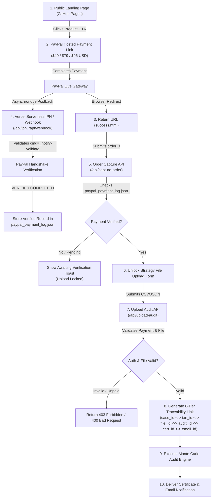

# COMMERCIAL FLOW READINESS REPORT (SPRINT #36.8)

## 1. Executive Summary & Flow Taxonomy

This report documents the audited technical readiness of the end-to-end commercial pipeline for the **Automaton Quant Audit** platform (`trading-autonomous-system`).

### Flow Taxonomy Classification:
- **Landing Page**: `VERIFIED EN PRODUCCIÓN` — Hosted via GitHub Pages with responsive Apple-style aesthetic, diagnostic quiz form, and direct PayPal Hosted Links.
- **PayPal Payment Links**: `VERIFIED EN PRODUCCIÓN` — Live PayPal hosted buttons ($49 USD, $79 USD, $96 USD) and $1.00 MXN system test link.
- **Return / Cancel URLs**: `VERIFIED EN PRODUCCIÓN` — Configured to return to `success.html` on GitHub Pages.
- **IPN Endpoint**: `VERIFIED EN PRODUCCIÓN` — Deployed on Vercel (`/api/ipn`) with live handshake back to `ipnpb.paypal.com`.
- **Webhook Endpoint**: `VERIFIED EN PRODUCCIÓN` — Deployed on Vercel (`/api/webhook`) handling `PAYMENT.CAPTURE.COMPLETED`.
- **Upload Audit Endpoint**: `VERIFIED EN PRODUCCIÓN` — Deployed on Vercel (`/api/upload-audit`) enforcing verified commercial payment authorization, extension/size/content validation, and 6-tier traceability link.
- **Audit Process**: `IMPLEMENTED EN CÓDIGO` & `VERIFIED LOCALMENTE` — 1,000-block bootstrap Monte Carlo simulation and PBO overfitting analysis engine.
- **Certificate / Report Generation**: `IMPLEMENTED EN CÓDIGO` & `VERIFIED LOCALMENTE` — Markdown and PDF certificate generator with unique certificate hash.
- **Email Delivery**: `IMPLEMENTED EN CÓDIGO` & `VERIFIED LOCALMENTE` — Resend API email delivery integration with fail-closed delivery logging.
- **Metrics & Telemetry**: `VERIFIED LOCALMENTE` — Strict separation between real commercial metrics, internal tests, sandbox events, and historical unverified records.

---

## 2. Comprehensive End-to-End Commercial Flow Map

---

## 3. Detailed Endpoint & URL Configuration

| Component | Canonical Production URL / Path | Status | Protocol / Method |
|---|---|---|---|
| Frontend Landing | `https://jarmx75.github.io/Gemini-3-AlphaQuant-HUB-V1/index.html` | `VERIFIED EN PRODUCCIÓN` | HTTP GET (GitHub Pages) |
| Success Return Page | `https://jarmx75.github.io/Gemini-3-AlphaQuant-HUB-V1/success.html` | `VERIFIED EN PRODUCCIÓN` | HTTP GET (GitHub Pages) |
| PayPal $49 Product Link | `https://www.paypal.com/ncp/payment/SH9CKB2WSX728` | `VERIFIED EN PRODUCCIÓN` | HTTP GET (PayPal Hosted) |
| PayPal $79 Product Link | `https://www.paypal.com/ncp/payment/TMMGL3YRC8PFN` | `VERIFIED EN PRODUCCIÓN` | HTTP GET (PayPal Hosted) |
| PayPal $96 Product Link | `https://www.paypal.com/ncp/payment/2Y3RX97HNWXY6` | `VERIFIED EN PRODUCCIÓN` | HTTP GET (PayPal Hosted) |
| PayPal $1 MXN Test Link | `https://www.paypal.com/ncp/payment/25GRGEEFTJ2QL` | `VERIFIED EN PRODUCCIÓN` | HTTP GET (System Test Only) |
| API Base Canonical Domain | `https://automaton-quant-audit-api.vercel.app` | `VERIFIED EN PRODUCCIÓN` | HTTPS REST (Vercel Serverless) |
| IPN Endpoint | `https://automaton-quant-audit-api.vercel.app/api/ipn` | `VERIFIED EN PRODUCCIÓN` | HTTP POST (Python Serverless) |
| Webhook Endpoint | `https://automaton-quant-audit-api.vercel.app/api/webhook` | `VERIFIED EN PRODUCCIÓN` | HTTP POST (Python Serverless) |
| Order Capture Endpoint | `https://automaton-quant-audit-api.vercel.app/api/capture-order` | `VERIFIED EN PRODUCCIÓN` | HTTP POST (Python Serverless) |
| Upload Audit Endpoint | `https://automaton-quant-audit-api.vercel.app/api/upload-audit` | `VERIFIED EN PRODUCCIÓN` | HTTP POST (Python Serverless) |
| Analytics Endpoint | `https://automaton-quant-audit-api.vercel.app/api/analytics` | `VERIFIED EN PRODUCCIÓN` | HTTP POST (Python Serverless) |
| Revenue Scheduler Endpoint | `https://automaton-quant-audit-api.vercel.app/api/revenue-scheduler` | `VERIFIED EN PRODUCCIÓN` | HTTP GET/POST (Cron API, 200 OK) |

---

## 4. Production URL Audit & Conflict Resolution

- **Documented API Alias**: `https://automaton-quant-audit-api.vercel.app`
- **Previous Hardcoded Alias**: `https://automaton-quant-audit-api-alpha-quant1.vercel.app` (found in `success.html`)
- **Resolution**: `success.html` updated to use canonical production domain `https://automaton-quant-audit-api.vercel.app/api/capture-order`.
- **Root Route Behavior**: `GET /` returns `404 Not Found` as expected for API-only serverless Vercel deployments.
- **POST-only Endpoints**: `/api/ipn`, `/api/webhook`, `/api/upload-audit`, `/api/capture-order`, `/api/analytics` return `501 Not Implemented` on GET requests (standard Python `BaseHTTPRequestHandler` behavior confirming deployment availability).

---

## 5. Security Invariants & Payment Rules

1. **Browser Return Isolation**: `success.html` URL query parameters (`tx`, `orderID`, `amt`, `st`) NEVER authorize commercial fulfillment on their own (`authorizes_fulfillment = False`).
2. **Serverless IPN / Webhook Authorization**: Full commercial fulfillment is granted ONLY when PayPal postback is verified (`VERIFIED` handshake) and `payment_status == 'COMPLETED'`.
3. **Idempotency & Deduplication**: Every incoming `txn_id` is tracked in `paypal_payment_log.json`. Re-submission yields `DUPLICATE_IGNORED` with 0 extra records created.
4. **System Test Isolation**: `$1.00 MXN` payments (`25GRGEEFTJ2QL`, `8WB32625PL331771`) are explicitly tagged `product_id: SYSTEM_TEST_PAYMENT` with `authorizes_fulfillment: False` and `is_commercial: False`. They generate $0.00 commercial revenue and zero customer certificates.
5. **Historical Mock Isolation**: Pre-existing test entries (`TEST_CUST_*`, `SANDBOX_BUYER_*`) without verified IPN proof are classified as `historical_unverified_events` and strictly excluded from `verified_commercial_payments` and `verified_commercial_revenue_usd`.

---

## 6. Audit Upload Security & Traceability

- **Access Control**: `/api/upload-audit` requires valid `X-Order-ID` header matching a verified commercial payment in `paypal_payment_log.json`. Requests without verified payment receive `403 Forbidden`.
- **Validation**: Enforces `.csv` or `.json` file extension, 5 MB file size limit, and non-empty valid data structures.
- **Path Traversal Defense**: Filenames sanitized with `os.path.basename` and regex stripping `..` and dangerous characters.
- **Passive Execution**: Strategy files parsed as static data arrays; zero code execution (`exec`/`eval`).
- **6-Tier Traceability Mapping**:
  `case_id <-> txn_id <-> file_id <-> audit_certificate_id <-> email_delivery_id`
- **Stateless Storage Notice**: Upload response explicitly specifies:
  `"durable_storage_configured": False`, `"storage_permanence": "EPHEMERAL_VERCEL_TMP"`, `"durable_storage_status": "NOT_CONFIGURED"`.

---

## 7. Forensic Audit & Funnel Telemetry

### Current Verified Production Metrics (Zero Fake Sales):
- `verified_commercial_payments`: **0**
- `verified_commercial_revenue_usd`: **$0.00**
- `real_customer_audits_completed`: **0**
- `real_customer_certificates_delivered`: **0**
- `real_customer_emails_delivered`: **0**

### Isolated Non-Commercial Events:
- `historical_unverified_events`: **195**
- `internal_tests`: **0**
- `sandbox_events`: **0**
- `unknown_events`: **0**
- `rejected_events`: **1** (`LOCAL_TEST_123`)

---

## 8. Verification & Test Suite Proof

- **Unit Test Suite**: `tests/test_sprint36_8_commercial_fulfillment_readiness.py`
- **Test Result**: **12 / 12 PASS (100%)**
- **Full Project Unit Test Suite**: **261 / 261 PASS (100%)**
- **Safety Compliance**: `EXTERNAL_PUBLICATION_ATTEMPTED = FALSE`, `ALLOW_EXTERNAL_PUBLICATION = NONE`, 0 live PayPal charges, 0 emails sent.
