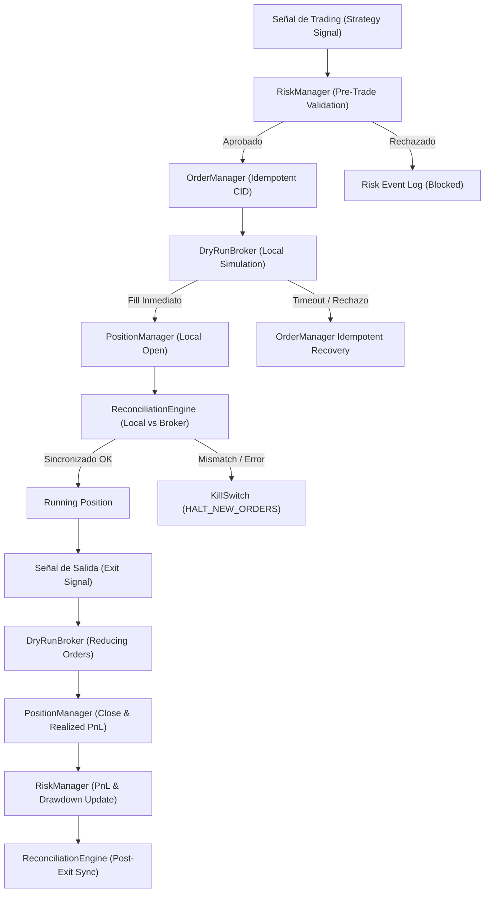

# Demo Dry-Run / Execution Rehearsal

Este documento describe la arquitectura, modos de operación, pruebas de inyección de fallos y lista de verificación operativa de la capa **Demo Dry-Run** del sistema Automaton.

---

## 1. Matriz de Entornos de Ejecución

| Entorno (`ExecutionMode`) | Red / Conexión Externa | Credenciales / API Keys | Ejecución de Órdenes | Propósito Operativo |
| :--- | :--- | :--- | :--- | :--- |
| **`PAPER`** | Red pública para Klines / Orderbook | No requeridas para órdenes | Simulación local en memoria | Acumular los 100 trades del Paper Gate en forward mode. |
| **`DRY_RUN`** | **CERO acceso a red** (100% local) | Claves simuladas locales | Mock Broker (`DryRunBroker`) | Ensayo de todo el stack de ejecución y prueba de fallos sin red. |
| **`DEMO`** | Testnet oficial Binance Futures | API Key / Secret de Testnet | Testnet REST / WSS | Simulación con exchange real de testnet (requiere Paper Gate). |
| **`REAL`** | Mainnet Binance Futures | Claves reales (encriptadas/estrictas) | Órdenes Reales con Capital | **ESTRICTAMENTE BLOQUEADO** (`APPROVED=false`, `REAL_ORDERS=0`). |

> [!IMPORTANT]
> `DRY_RUN` es explícitamente distinto de `DEMO`. En `DRY_RUN`, la URL base es `LOCAL_DRY_RUN_NO_NETWORK` y no se realiza ninguna petición HTTP/WSS externa.

---

## 2. Arquitectura del Flujo de Ejecución (Execution Pipeline)

---

## 3. Cobertura de Inyección de Fallos (Failure Injection Scenarios)

Se implementaron y verificaron **13 escenarios de prueba automatizados** en [`tests/test_demo_dry_run.py`](file:///Users/jorgeatilano/Desktop/DEVIN/trading-autonomous-system/tests/test_demo_dry_run.py):

| # | Escenario de Falla / Prueba | Mecanismo de Inyección | Comportamiento Esperado y Verificado | Estado |
| :-: | :--- | :--- | :--- | :---: |
| **1** | **Ciclo Normal Completo** | Flujo estándar de 2 piernas | Entrada $\to$ 2 Fills $\to$ Posición $\to$ Salida $\to$ PnL $\to$ Reconciliación OK | ✅ **PASS** |
| **2** | **Stale Market Data** | Latencia $> 30\text{s}$ en quote feed | `RiskManager` bloquea la orden; `KillSwitch` registra `STALE_MARKET_DATA`. | ✅ **PASS** |
| **3** | **API Timeout Simulado** | `broker.inject_timeout(True)` | `OrderManager` no duplica; consulta `clientOrderId` para recuperación idempotente. | ✅ **PASS** |
| **4** | **Submit Duplicado** | Mismo `clientOrderId` repetido | Retorna orden existente; cero duplicación de fills en el broker. | ✅ **PASS** |
| **5** | **Partial Fill** | `broker.inject_partial_fill(0.5)` | Ejecuta 50% de la cantidad; estado `PARTIALLY_FILLED`. | ✅ **PASS** |
| **6** | **Orden Rechazada** | `broker.inject_rejection(True)` | Orden `REJECTED`; estado local de posiciones permanece inalterado. | ✅ **PASS** |
| **7** | **Position Mismatch** | `broker.inject_position_mismatch()` | `ReconciliationEngine` detecta descuadre, activa `halt_required=True` y dispara `KillSwitch`. | ✅ **PASS** |
| **8** | **Unexpected Fill** | Posición no solicitada en broker | `ReconciliationEngine` detecta orden huérfana y exige halt inmediato. | ✅ **PASS** |
| **9** | **Kill Switch Circuit Breaker** | Activación manual / automática | Cancela todas las órdenes abiertas y bloquea cualquier nueva orden. | ✅ **PASS** |
| **10** | **Daily Loss Breach** | Pérdida acumulada $\le -\$50\text{ USD}$ | `RiskManager` bloquea inmediatamente nuevas entradas de trading. | ✅ **PASS** |
| **11** | **Strategy Drawdown Breach** | Drawdown de estrategia $\ge 10.0\%$ | `RiskManager` bloquea nuevas entradas para la estrategia afectada. | ✅ **PASS** |
| **12** | **Reinicio con Posición Abierta** | Simulación de reinicio de proceso | Se restaura estado local y se reconcilia 100% con las posiciones del broker. | ✅ **PASS** |
| **13** | **Aislamiento y Cero Polución** | Ejecución intensiva de Dry-Run | Cero peticiones a red; cero contaminación en `bitacora_pairs_trading_paper.csv`. | ✅ **PASS** |

---

## 4. Estructura de Logs Aislados (`logs/execution/dry_run/`)

Todos los eventos generados durante los ensayos Dry-Run se almacenan de forma independiente sin tocar los registros de paper trading:

- `orders.jsonl`: Registro de órdenes enviadas y estados de ciclo de vida.
- `fills.jsonl`: Registro detallado de ejecuciones, precios efectivos, comisiones y latencia.
- `positions.jsonl`: Registro de aperturas, cierres, holding y PnL realizado.
- `reconciliation.jsonl`: Auditorías de sincronización local vs broker.
- `risk_events.jsonl`: Registro de validaciones pre-trade y bloqueos de riesgo.
- `kill_switch.jsonl`: Registro de activaciones de parada de emergencia.

---

## 5. Lista de Verificación Previa a Binance Demo (Pre-Demo Checklist)

Antes de autorizar la conexión a Binance Demo / Testnet, el sistema verifica obligatoriamente:

- [x] **Reconciliación Validator vs Engine**: 100% paridad trade-by-trade verificada.
- [x] **Paper Gate Progress Monitor**: Monitor activo rastreando los 100 trades forward.
- [x] **Dry-Run Rehearsal**: 13/13 escenarios de falla y resiliencia aprobados.
- [x] **Suite de Tests**: 45/45 tests unitarios e integrados aprobados.
- [ ] **Paper Gate Threshold**: Acumulación de $\ge 100$ trades cerrados en forward paper mode (Actualmente: $0/100$, `PAPER_GATE_IN_PROGRESS`).
- [ ] **Aprobación Humana**: Firma manual explícita (`APPROVED`) tras superar el Paper Gate.

---

## 6. Estado de Seguridad Actual

- **`APPROVED = false`**
- **`DEMO_ORDERS = 0`**
- **`REAL_ORDERS = 0`**
- **`REAL_TRADING_ENABLED = false`**
- **`BINANCE_ENV = PAPER / DRY_RUN`**
